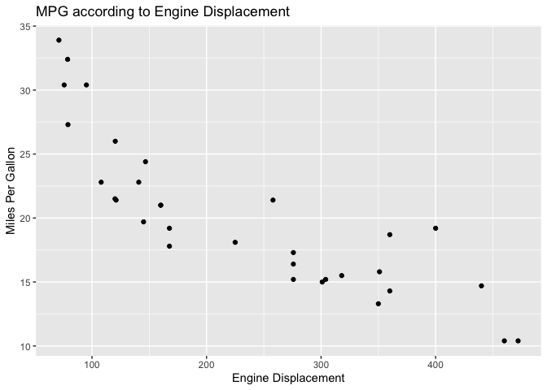

# Untitled
Daniel Bagley

``` r
pacman::p_load(tidyverse)

ggplot(mtcars, aes(y = mpg, x = disp)) + 
  geom_point() +
  labs(title = "MPG according to Engine Displacement",
       y = "Miles Per Gallon",
       x = "Engine Displacement")
```


